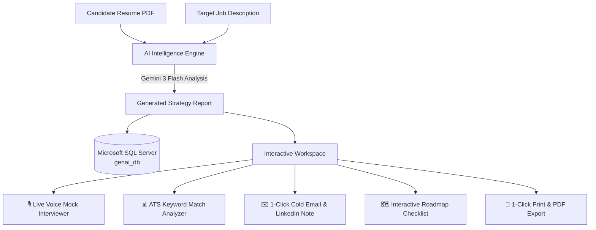

<div align="center">

# ⚡ PrepAI - AI-Powered Career & Mock Interview Intelligence Platform

### *Transform Any Job Description & Resume into a Winning Interview Strategy in Seconds*

[](https://react.dev/)
[](https://nodejs.org/)
[](https://www.sqlite.org/)
[](https://aistudio.google.com/)
[](LICENSE)

<br/>

[🌐 **Live Demo Application**](https://genai-interview-prep-git-main-aaradhana1712s-projects.vercel.app) • [✨ **Features**](#-key-features) • [📐 **System Architecture**](#-system-architecture) • [🚀 **Getting Started**](#-getting-started) • [🔌 **API Endpoints**](#-api-endpoints)

</div>

---

## 🌐 Live Demo & Deployment

| Service | Status | Link |
| :--- | :--- | :--- |
| **Frontend Web App** | 🟢 Live on Vercel | [👉 **Open Live Web App**](https://genai-interview-prep-git-main-aaradhana1712s-projects.vercel.app) |
| **Backend API Server** | 🟢 Live on Render | [👉 **API Endpoint Health**](https://genai-backend-tiqz.onrender.com) |

---

## 💡 Why PrepAI?

Landing tech jobs in today's competitive market requires more than generic practice. **PrepAI** bridges the gap between candidate resumes and specific target job descriptions:

1. **Hyper-Personalized Questions:** Generates role-specific technical and behavioral questions based on your actual experience vs. job requirements.
2. **Real-Time Voice Mock Interview:** Evaluates candidate speech in real time with scoring, technical gap detection, and model answers.
3. **ATS Match Score:** Reveals exactly which keywords are present or missing before you apply.
4. **Direct Recruiter Outreach:** Generates tailored cold emails and LinkedIn connection notes to skip the applicant queue.

---

## 📐 System Architecture & Workflow



---

## ✨ Feature Deep Dive

### 🎙️ 1. Live AI Mock Interviewer (Voice & Text)
- Practice speaking your answers aloud using built-in **Browser Speech-to-Text (Web Speech API)** or typing.
- Instant AI evaluation providing:
  - **Rating (out of 10)** based on technical accuracy and communication.
  - **Strengths:** Key technical concepts correctly highlighted.
  - **Improvement Areas:** Essential industry concepts or depth omitted.
  - **Ideal Model Answer:** Exemplary STAR/technical response for reference.

### 📊 2. ATS Resume Compatibility & Keyword Analyzer
- Calculates an **ATS Compatibility Match Score (%)**.
- **Matched Keywords (Green Chips):** Skills, frameworks, and tools found in your profile.
- **Missing Keywords (Red Chips):** Crucial technologies mentioned in the JD that need inclusion to pass automated recruiter screeners.

### ✉️ 3. 1-Click Recruiter & HR Cold Outreach
- **Cold Email to Hiring Manager:** Compelling subject line and personalized body highlighting your top fit points.
- **LinkedIn Connection Note:** High-converting, friendly message crafted strictly under the **300-character** LinkedIn limit.
- 1-click **Copy to Clipboard** button.

### 🗺️ 4. Interactive Day-by-Day Roadmap Tracker
- Structured, multi-day preparation schedule prioritizing weak areas first.
- Interactive checkboxes saved dynamically in **Browser LocalStorage**.
- Real-time **Readiness Progress Bar** (`X of Y tasks completed • % Ready`).

### 🖨️ 5. 1-Click Print & PDF Strategy Export
- Clean, media-optimized print stylesheet (`@media print`) to export the complete interview plan to a beautiful PDF document with one click.

---

## 🛠️ Complete Tech Stack

```
Frontend:
├── React 19.2 (Modern Component Architecture)
├── Vite 7.3 (Lightning Fast HMR Bundler)
├── React Router 7.13 (Client-side Routing)
├── Sass / SCSS (Custom Glassmorphic Dark UI)
└── Axios (HTTP & Cookie Session Client)

Backend:
├── Node.js 20.x + Express 5.2
├── Microsoft SQL Server (SQLEXPRESS / Azure SQL / MSSQL)
├── Google Gemini API (@google/genai & gemini-3-flash-preview)
├── Multer (In-memory secure file handling)
├── pdf-parse (Resilient document extraction)
├── bcryptjs & jsonwebtoken (Secure Authentication & Salt Hashing)
└── Puppeteer (PDF compilation engine)
```

---

## 📂 Repository Structure

```
├── Backend/                        # Node.js Express REST API
│   ├── src/
│   │   ├── config/database.js      # MSSQL Connection Pool
│   │   ├── controllers/            # Auth & Interview Business Logic
│   │   ├── middlewares/            # Auth, CORS, & Multer Upload
│   │   ├── models/                 # SQL Server Models (users, interview_reports, blacklist_tokens)
│   │   ├── routes/                 # API Endpoints
│   │   └── services/ai.service.js  # Gemini AI Prompting & Parsing
│   ├── .env.example                # Sample Environment Template
│   ├── package.json
│   └── server.js                   # Server bootstrap (Port 3000)
│
├── Frontend/                       # React 19 + Vite Client
│   ├── src/
│   │   ├── features/
│   │   │   ├── auth/               # Login, Register, Protected Route, Context
│   │   │   └── interview/          # Home, Interview Report, Mock Test, ATS, Styles
│   │   ├── App.jsx
│   │   └── main.jsx
│   ├── vite.config.js              # Vite Dev & Build Configuration
│   └── package.json
│
├── run.bat                         # 1-Click Windows Development Launcher
├── .gitignore                      # Security-guarded git ignore (protects .env & secrets)
└── README.md                       # Comprehensive Documentation
```

---

## 🚀 Getting Started (Local Setup)

### 1. Prerequisites
- **Node.js** (v18 or v20+)
- **Microsoft SQL Server** (SQLEXPRESS, LocalDB, or Developer Edition)
- **Google AI Studio API Key** (Free from [aistudio.google.com](https://aistudio.google.com/))

### 2. Clone the Repository
```bash
git clone https://github.com/your-username/genai-interview-prep.git
cd genai-interview-prep
```

### 3. Backend Setup
```bash
cd Backend
npm install
```

Create a `.env` file in the `Backend` directory:
```env
PORT=3000
DB_USER=genai_user
DB_PASSWORD=GenaiPassword123!
DB_SERVER=localhost
DB_NAME=genai_db
DB_INSTANCE=SQLEXPRESS
JWT_SECRET=your_super_secret_jwt_key
GOOGLE_GENAI_API_KEY=your_gemini_api_key_here
```

### 4. Frontend Setup
```bash
cd ../Frontend
npm install
```

### 5. Run the Project

#### 💡 Windows (1-Click Run):
Simply double-click [`run.bat`](run.bat) in the root directory! It will launch both Backend and Frontend in separate windows.

#### 💻 Manual Run:
```bash
# Terminal 1 (Backend)
cd Backend && npm run dev

# Terminal 2 (Frontend)
cd Frontend && npm run dev
```

Visit **`http://localhost:5173`** or **`http://localhost:5174`** in your browser.

---

## 🔌 API Endpoints

| Method | Endpoint | Description | Auth Required |
| :--- | :--- | :--- | :---: |
| `POST` | `/api/auth/register` | Register new user account | ❌ |
| `POST` | `/api/auth/login` | Authenticate user & set JWT cookie | ❌ |
| `GET` | `/api/auth/get-me` | Get currently logged-in user profile | ✅ |
| `GET` | `/api/auth/logout` | Clear session & blacklist token | ✅ |
| `POST` | `/api/interview/` | Generate complete interview strategy report | ✅ |
| `GET` | `/api/interview/` | Get all generated reports for current user | ✅ |
| `GET` | `/api/interview/report/:id` | Fetch specific interview strategy report | ✅ |
| `POST` | `/api/interview/evaluate-answer`| Live AI evaluation of mock answer | ✅ |
| `GET` | `/api/interview/outreach/:id` | Generate cold email & LinkedIn note | ✅ |
| `POST` | `/api/interview/resume/pdf/:id`| Download compiled resume PDF | ✅ |

---

## 🚢 Deployment Guide

### Deploying Frontend to Vercel
1. Import this repository into [Vercel](https://vercel.com/).
2. Set **Root Directory** to `Frontend`.
3. Under **Environment Variables**, set:
   - `VITE_API_URL` = `https://your-backend.onrender.com`
4. Click **Deploy**.

### Deploying Backend to Render.com
1. Create a **Web Service** on [Render.com](https://render.com/).
2. Set **Root Directory** to `Backend`.
3. Set **Build Command** to `npm install` and **Start Command** to `node server.js`.
4. Add your Environment Variables (`GOOGLE_GENAI_API_KEY`, `JWT_SECRET`, and Cloud Database credentials).
5. Deploy service.

---

## 🔒 Security & Best Practices
- **Protected Secrets:** `.env` and sensitive files are strictly excluded from version control via `.gitignore`.
- **Encrypted Passwords:** Passwords hashed with `bcryptjs` using 10 salt rounds.
- **Hardened Cookies:** JWT tokens set with `httpOnly: true`, `sameSite: "lax"`, and expiration limits.
- **SQL Injection Prevention:** Parameterized SQL queries using `@param` with typed data inputs.

---

## 👤 Author & Support

- **Author:** Aaradhana Mewade
- **GitHub:** [@aaradhana1712](https://github.com/aaradhana1712)
- **LinkedIn:** [Connect on LinkedIn](https://linkedin.com/)

⭐ **If you find this project helpful, give it a star on GitHub!**

---

## 📄 License
This project is licensed under the [MIT License](LICENSE).
